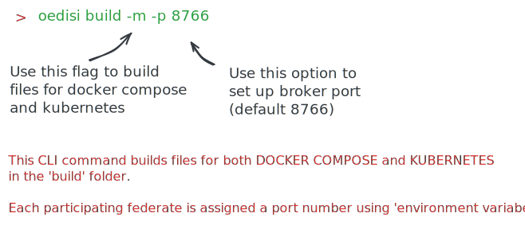
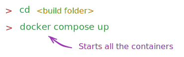
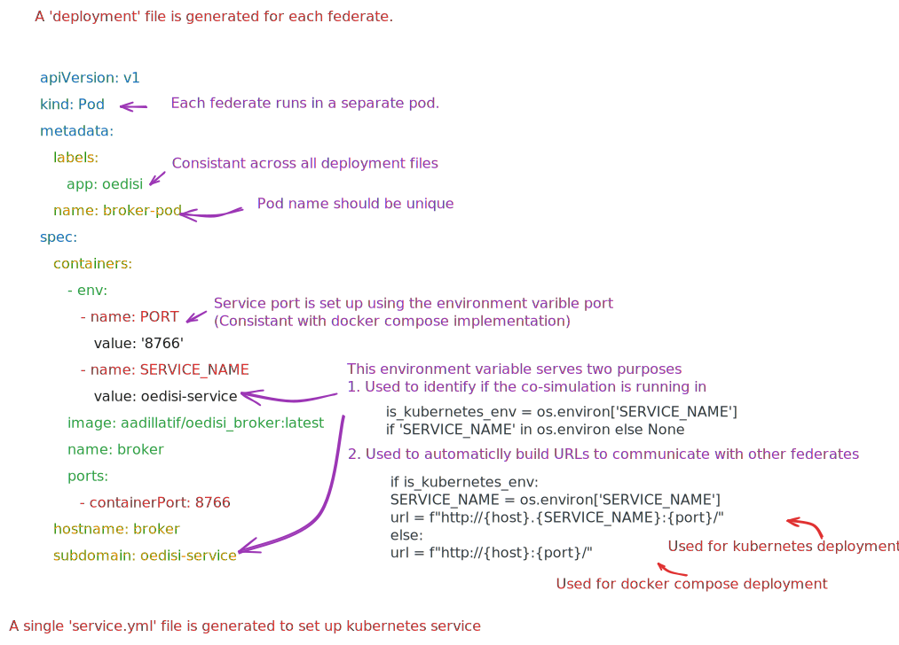
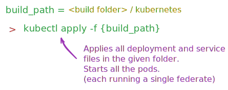

Multi-Container Setup
*********************

In this user guide, we provide step by step instructions for orchestration of multi-container co-simulation for an existing OEDISI project. 

Multi-container co-simulations requires containers to communicate with other containers participating in the co-simulation federation.  This is achieved via a REST API interface. This interface allows users to start / stop co-simulation runs, upload profiles and models and download co-simulation results once the simulation is complete.

This means, any new container needs to have a REST API implementation to be able to communicate with participating containers.

Once this initial step is complete, the simulation can be setup using the following step by step process.

Step 0 - Requirements for a multi-container setup
-------------------------------------------------

User has two main responsibilities when integrating a new container (see https://github.com/openEDI/oedisi-example/tree/main/wls_federate).

1. Implementation of a REST API interface for the algorithm. Three required endpoints are:  
   
   - GET ("/") : This root endpoint is used for container health Check
   - POST ("/configure"): This endpoint takes Component Structure as JSON payload and is used to configure the federate
   - POST ("/run") : This endpoint takes broker config JSON as payload and starts the federate (connects to the broker and takes federate to HELICS execution mode)

A minimal example is provided below

.. code-block:: python 

    from fastapi import FastAPI, BackgroundTasks, HTTPException
    from state_estimator_federate import run_simulator
    from oedisi.types.common import BrokerConfig
    from fastapi.responses import JSONResponse
    import traceback
    import uvicorn
    import socket
    import json
    import sys
    import os

    from oedisi.componentframework.system_configuration import ComponentStruct
    from oedisi.types.common import ServerReply, HeathCheck, DefaultFileNames

    app = FastAPI()

    @app.get("/")
    def read_root():
        hostname = socket.gethostname()
        host_ip = socket.gethostbyname(hostname)
        response = HeathCheck(
            hostname=hostname,
            host_ip=host_ip
        ).dict()
        return JSONResponse(response, 200)

    @app.post("/run")
    async def run_model(broker_config: BrokerConfig, background_tasks: BackgroundTasks):
        print(broker_config)
        try:
            background_tasks.add_task(run_simulator, broker_config)
            response = ServerReply(
                detail="Task sucessfully added."
            ).dict()
            return JSONResponse(response, 200)
        except Exception as e:
            err = traceback.format_exc()
            HTTPException(500, str(err))

    @app.post("/configure")
    async def configure(component_struct:ComponentStruct): 
        component = component_struct.component
        params = component.parameters
        params["name"] = component.name
        links = {}
        for link in component_struct.links:
            links[link.target_port] = f"{link.source}/{link.source_port}"
        json.dump(links , open(DefaultFileNames.INPUT_MAPPING.value, "w"))
        json.dump(params , open(DefaultFileNames.STATIC_INPUTS.value, "w"))
        response = ServerReply(
                detail = f"Sucessfully updated configuration files."
            ).dict() 
        return JSONResponse(response, 200)

    if __name__ == "__main__":
        uvicorn.run(app, host="0.0.0.0", port=int(os.environ['PORT']))

2. For Python code bases, create a requirements.txt file with all required dependencies for the algorithm being integrated. A docker file is generated automatically during the build process
3. For other languages, create a docker file with all required dependencies setup.
4. Update the Wiring Diagram. Make sure the connections are valid. Ensure a unique container port and hostname is assigned to each 'component' in the wiring diagram (see example below).

.. code-block:: json

    {
        "name": "recorder_voltage_real",
        "type": "Recorder",
        "host": "recorder-voltage-real",
        "container_port": 5679,
        "parameters": {
            "feather_filename": "voltage_real.feather",
            "csv_filename": "voltage_real.csv"
        }
    }

Step 1 - Building Docker-Compose and Kubernetes deployment files
----------------------------------------------------------------

Deployment files for Docker-Compose and Kubernetes are built using the following CLI command.

Step 2a - Running containers using Docker-Compose
-------------------------------------------------

OEDISI supports multi-container orchestration via Docker-Compose and Kubernetes.  
Docker-Compose is well suited for single machine multi-container co-simulation run. 

The image below provides details on the auto-generate Docker-Compose file.

.. image:: images/step_2a.svg
  :width: 800
  :alt: Alternative text

Containers can be orchestrated using Docker compose using the following CLI command. Make sure Docker deamon is running before running the CLI command below

Step 2b - Running containers using Kubernetes
---------------------------------------------
Kubernetes will enable multi-machine \ cloud orchestration of OEDISI co-simulations. This is well suited for private algorithm use case. Make sure Kubernetes cluster is running before running the CLI command below

Containers can be orchestrated using Kubernetes using the following CLI command

Step 3 - Running containers using Kubernetes
--------------------------------------------
In this multi-container implementation, the 'Broker' container is the sole container the user is expected to interface with. 
The API endpoints (listed above) enables the broker federate to users to setup and run co-simulations

.. image:: images/step_4.png

Docker Compose Orchestration - Video tutorial
---------------------------------------------

..  youtube:: byVK8W2m99U
  :width: 100%

Kubernetes Orchestration - Video tutorial
-----------------------------------------

FAQs
----

- If build is not using local changes, then try docker compose build --no-cache.
- If using M1 or M2, HELICS in Docker requires x86 emulation with by using export DOCKER_DEFAULT_PLATFORM=linux/amd64